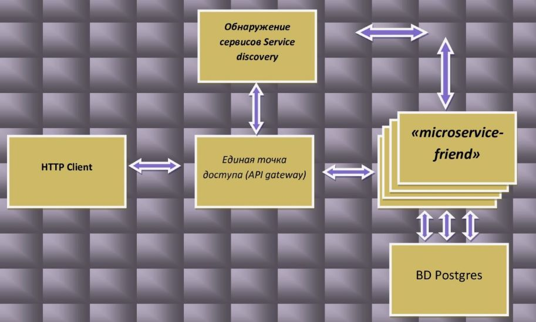
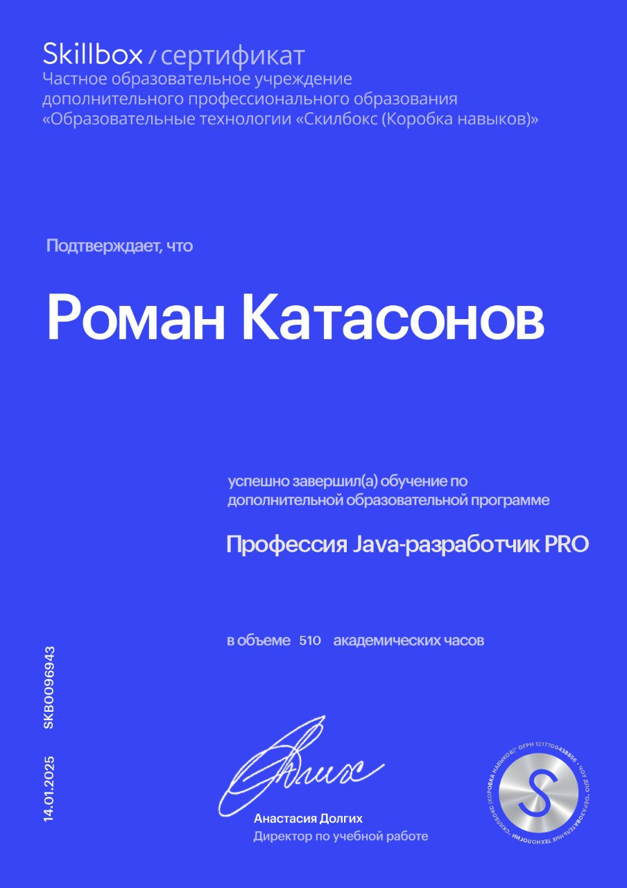

# Командный проект курса «Java-разработчик – Социальная сеть»
###  В основе проекта лежит Микросервисная архитектура стека Java-технологий

### Используемые технологии
- Spring Boot 2.7
- Maven 3
- Lombok
- Mapstruct
- Liquibase
- PostgreSQL
- Nimbus-jose-jwt
- Openfeign
- Spring-kafka
- Spring-cloud-starter-netflix-eureka-client

## Требования

### JDK 17
Проект использует синтаксис Java 17. 
### Docker
Для запуска проекта вам потребуется установленный и запущенный Docker.
Для запуска БД(PostgreSQL) требется запустить соответствующий сервис в Docker.

##   Сервис отвечает за взаимодействия между пользователями социальной сети. То есть мой сервис регулирует:
- Оправку запроса на добавления в друзья
-  Подтверждение дружбы и добавление других пользователей в список друзей
-	Удаление  из друзей
-	Подписку на пользователя
-	Есть возможность блокировать пользователей
- Реализована логика рекомендации возможных друзей. В основе логики лежит рекомендация тех пользователей социальной сети,  у которых два и более общих друзей. Возможно изменение этого параметра.
- Взаимодействие с другими сервисами производится с помощью технологии  Openfeign. Выбор данного REST-клиент основывался на его декларативности.


### Запуск и  развертывание контейнера 

```bash
mvn package 
docker build -t romakat77/microservice-friend:latest .
docker login
docker push romakat77/microservice-friend:latest
docker pull romakat77/microservice-friend:latest
docker run --name friend2 -p 8087:8087 romakat77/microservice-friend:latest
```


### IntelliJ IDEA

Запустите main метод класса Application


## Database:
- Postgresql
## Tests:
- Результат покрытия тестами 91%
##  Sertifico:


